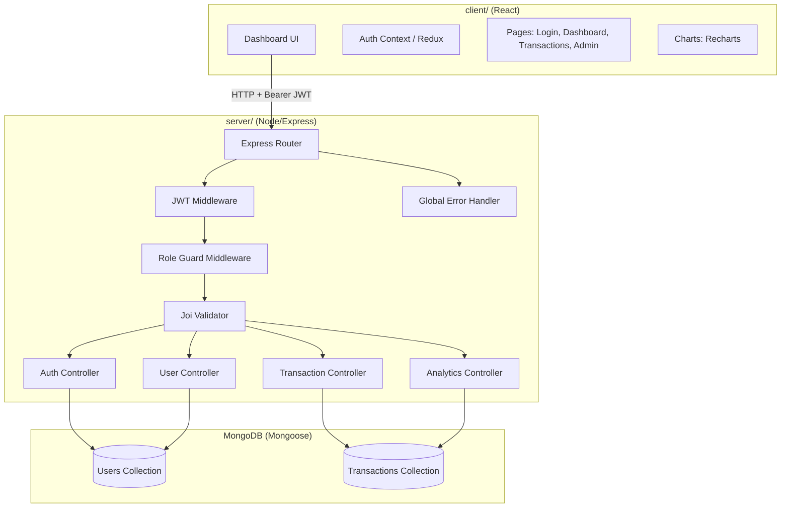

# Design Document: Finance Dashboard

## Overview

The Finance Dashboard is a full-stack MERN application providing financial record management, role-based access control, and aggregated analytics. The system is split into a Node.js/Express REST API backend and a React.js frontend, communicating over HTTP with JWT-based stateless authentication.

Three user roles exist with progressively elevated permissions:
- **Viewer**: read-only access to transactions and basic analytics
- **Analyst**: Viewer access plus advanced analytics endpoints
- **Admin**: full CRUD over transactions and users

The backend enforces authorization at the route level via middleware. The frontend conditionally renders UI based on the authenticated user's role.

---

## Architecture



**Request lifecycle:**
1. React client sends HTTP request with `Authorization: Bearer <token>` header
2. JWT middleware verifies token; rejects with 401 if missing/invalid/expired
3. Role guard middleware checks user role against required permission; rejects with 403 if insufficient
4. Joi validator validates request body/query; rejects with 422 if invalid
5. Controller executes business logic against MongoDB via Mongoose
6. Global error handler catches any unhandled errors and returns structured JSON

---

## Components and Interfaces

### Backend Components

#### Auth Controller (`server/controllers/authController.js`)
- `POST /api/auth/register` — validate body, hash password, create user, return JWT
- `POST /api/auth/login` — validate credentials, check active status, return JWT

#### User Controller (`server/controllers/userController.js`)
- `GET /api/users` — Admin only; return all users excluding password
- `PUT /api/users/:id` — Admin only; update role or status
- `DELETE /api/users/:id` — Admin only; soft-delete user

#### Transaction Controller (`server/controllers/transactionController.js`)
- `GET /api/transactions` — All roles; supports `startDate`, `endDate`, `category`, `type`, `page`, `limit` query params
- `POST /api/transactions` — Admin only; create transaction
- `PUT /api/transactions/:id` — Admin only; update transaction
- `DELETE /api/transactions/:id` — Admin only; soft-delete transaction

#### Analytics Controller (`server/controllers/analyticsController.js`)
- `GET /api/analytics/summary` — All roles; total income, expenses, net balance
- `GET /api/analytics/category-breakdown` — All roles; spending by category
- `GET /api/analytics/monthly-trends` — All roles; income/expense by month (trailing 12)
- `GET /api/analytics/weekly-trends` — All roles; income/expense by ISO week (trailing 8)
- `GET /api/analytics/recent-activity` — All roles; 10 most recent transactions
- `GET /api/analytics/insights` — Analyst + Admin only; advanced summary

#### Middleware
- `server/middleware/auth.js` — verifies JWT, attaches `req.user`
- `server/middleware/roleGuard.js` — factory `requireRole(...roles)` returning middleware
- `server/middleware/validate.js` — wraps Joi schemas into Express middleware

#### Global Error Handler (`server/middleware/errorHandler.js`)
- Catches all errors passed via `next(err)`
- Maps Mongoose `CastError` → 400, duplicate key `11000` → 409, Joi validation → 422
- Returns `{ success: false, error: string, statusCode: number }`

### Frontend Components

#### Pages
- `LoginPage` — email/password form, calls `/api/auth/login`, stores JWT
- `DashboardPage` — summary cards + trend chart + category chart + recent activity
- `TransactionsPage` — paginated table with filter controls
- `AdminPage` — transaction CRUD forms + user management table

#### Shared Components
- `PrivateRoute` — redirects unauthenticated users to `/login`
- `AdminRoute` — redirects non-Admin users to `/dashboard`
- `SummaryCard` — displays a single metric (label + value)
- `TrendChart` — Recharts `LineChart` or `BarChart` for monthly/weekly trends
- `CategoryChart` — Recharts `PieChart` for category breakdown
- `TransactionTable` — paginated table with sort/filter
- `FilterBar` — date range, category, type filter inputs

#### State Management
- `AuthContext` (Context API) — stores `{ user, token, login(), logout() }`
- Axios instance with request interceptor to attach `Authorization` header
- React Query (or `useEffect`/`useState`) for server state caching

---

## Data Models

### User Schema (`server/models/User.js`)

```js
{
  name:      { type: String, required: true, trim: true },
  email:     { type: String, required: true, unique: true, lowercase: true },
  password:  { type: String, required: true },          // bcrypt hash
  role:      { type: String, enum: ['Viewer','Analyst','Admin'], default: 'Viewer' },
  status:    { type: String, enum: ['Active','Inactive'], default: 'Active' },
  isDeleted: { type: Boolean, default: false },
  createdAt: { type: Date, default: Date.now },
  updatedAt: { type: Date, default: Date.now }
}
```

Indexes: unique on `email`; compound `{ isDeleted: 1, status: 1 }` for login queries.

### Transaction Schema (`server/models/Transaction.js`)

```js
{
  amount:      { type: Number, required: true, min: 0.01 },
  type:        { type: String, enum: ['Income','Expense'], required: true },
  category:    { type: String, enum: ['Food','Salary','Rent','Transport','Healthcare','Entertainment','Other'], required: true },
  date:        { type: Date, required: true },
  description: { type: String, trim: true, default: '' },
  isDeleted:   { type: Boolean, default: false },
  createdAt:   { type: Date, default: Date.now },
  updatedAt:   { type: Date, default: Date.now }
}
```

Indexes: `{ isDeleted: 1, date: -1 }` for filtered list queries; `{ isDeleted: 1, category: 1 }` for category breakdown aggregation.

### JWT Payload

```js
{ id: ObjectId, role: 'Viewer' | 'Analyst' | 'Admin', iat: number, exp: number }
```

### API Response Envelope

All API responses follow a consistent shape:

```js
// Success
{ success: true, data: <payload> }

// Error
{ success: false, error: <message>, statusCode: <number> }

// Paginated list
{ success: true, data: [...], total: number, page: number, limit: number }
```

### Analytics Aggregation Shapes

**Summary:**
```js
{ totalIncome: number, totalExpenses: number, netBalance: number }
```

**Category Breakdown:**
```js
[{ category: string, total: number }]
```

**Monthly / Weekly Trends:**
```js
[{ period: string, income: number, expenses: number }]
```


---

## Correctness Properties

*A property is a characteristic or behavior that should hold true across all valid executions of a system — essentially, a formal statement about what the system should do. Properties serve as the bridge between human-readable specifications and machine-verifiable correctness guarantees.*

### Property 1: Registration round-trip produces valid JWT

*For any* valid (name, email, password, role) tuple, calling the register endpoint should return a JWT that can be verified with the configured JWT_SECRET and whose payload contains the correct user id and role.

**Validates: Requirements 1.1, 11.2**

---

### Property 2: Stored passwords are bcrypt hashes with cost >= 10

*For any* registered user, the password field stored in the database should be a valid bcrypt hash string whose embedded cost factor is greater than or equal to 10.

**Validates: Requirements 1.5**

---

### Property 3: Login round-trip returns JWT for valid credentials

*For any* registered active user, submitting the correct email and password to the login endpoint should return a signed JWT containing the user's id and role.

**Validates: Requirements 1.3**

---

### Property 4: User list never exposes password field

*For any* set of users in the database, the Admin list-users endpoint should return records where no document contains a `password` field.

**Validates: Requirements 2.2**

---

### Property 5: User update persists role and status changes

*For any* existing user and any valid (role, status) pair, calling the update endpoint should result in the user document reflecting the new values when subsequently retrieved.

**Validates: Requirements 2.3**

---

### Property 6: User soft-delete sets isDeleted flag

*For any* existing user, calling the delete endpoint should set `isDeleted: true` on the user document without removing it from the database.

**Validates: Requirements 2.4**

---

### Property 7: Transaction creation returns 201 with all required fields

*For any* valid transaction payload submitted by an Admin, the create endpoint should return HTTP 201 and a response body containing amount, type, category, date, and description matching the submitted values.

**Validates: Requirements 3.1, 3.2**

---

### Property 8: Transaction update persists specified field changes

*For any* existing non-deleted transaction and any valid partial update payload, the update endpoint should return the transaction document with the updated fields reflected.

**Validates: Requirements 3.3**

---

### Property 9: Transaction soft-delete sets isDeleted flag

*For any* existing transaction, calling the delete endpoint should set `isDeleted: true` on the transaction document without removing it from the database.

**Validates: Requirements 3.4**

---

### Property 10: Read endpoint never returns soft-deleted transactions

*For any* state of the transactions collection (including a mix of deleted and non-deleted records), the read endpoint should return only transactions where `isDeleted` is false.

**Validates: Requirements 3.5**

---

### Property 11: Date range filter returns only in-range transactions

*For any* startDate/endDate pair and any set of non-deleted transactions, the filtered read endpoint should return only transactions whose date falls within [startDate, endDate] inclusive.

**Validates: Requirements 4.1**

---

### Property 12: Category filter returns only matching transactions

*For any* category value and any set of non-deleted transactions, the filtered read endpoint should return only transactions whose category equals the specified value.

**Validates: Requirements 4.2**

---

### Property 13: Type filter returns only matching transactions

*For any* type value (Income or Expense) and any set of non-deleted transactions, the filtered read endpoint should return only transactions whose type equals the specified value.

**Validates: Requirements 4.3**

---

### Property 14: Combined filters apply as AND condition

*For any* combination of date range, category, and type filters applied simultaneously, the result set should equal the intersection of each individual filter applied independently.

**Validates: Requirements 4.4**

---

### Property 15: Pagination returns correct subset and accurate total count

*For any* page number and limit value, the paginated read endpoint should return at most `limit` records corresponding to the correct offset, and the `total` field should equal the count of all matching (non-deleted, filtered) records.

**Validates: Requirements 4.5**

---

### Property 16: Summary totals are arithmetically correct

*For any* set of non-deleted transactions, the summary endpoint should return totalIncome equal to the sum of all Income transaction amounts, totalExpenses equal to the sum of all Expense transaction amounts, and netBalance equal to totalIncome minus totalExpenses.

**Validates: Requirements 5.1**

---

### Property 17: Category breakdown correctly groups and sums amounts

*For any* set of non-deleted transactions, the category breakdown endpoint should return one entry per category present, where each entry's total equals the sum of amounts for all transactions in that category.

**Validates: Requirements 5.2**

---

### Property 18: Monthly trends correctly aggregate by calendar month

*For any* set of non-deleted transactions, the monthly trends endpoint should return entries covering the trailing 12 calendar months where each entry's income and expenses values equal the sums of the corresponding transaction amounts for that month.

**Validates: Requirements 5.3**

---

### Property 19: Weekly trends correctly aggregate by ISO week

*For any* set of non-deleted transactions, the weekly trends endpoint should return entries covering the trailing 8 ISO weeks where each entry's income and expenses values equal the sums of the corresponding transaction amounts for that week.

**Validates: Requirements 5.4**

---

### Property 20: Recent activity returns exactly 10 most recent non-deleted transactions

*For any* set of non-deleted transactions with at least 10 records, the recent activity endpoint should return exactly 10 transactions ordered by date descending, matching the 10 most recently dated records.

**Validates: Requirements 5.5**

---

### Property 21: Validation errors return 422 with all error details

*For any* request body that fails schema validation, the response should have HTTP status 422 and the body should contain a list of all validation errors (not just the first one).

**Validates: Requirements 6.1**

---

### Property 22: Error responses always follow the structured envelope

*For any* error condition (validation failure, auth failure, not found, server error), the response body should always contain `success: false`, an `error` string, and the appropriate HTTP status code.

**Validates: Requirements 7.1**

---

## Error Handling

### Backend Error Handling Strategy

All errors flow through a single Express error-handling middleware registered last in the middleware chain.

**Error classification and mapping:**

| Error Type | HTTP Status | Trigger |
|---|---|---|
| Joi `ValidationError` | 422 | Request body/query fails schema |
| JWT `JsonWebTokenError` | 401 | Malformed or missing token |
| JWT `TokenExpiredError` | 401 | Token past expiry |
| Role guard failure | 403 | Insufficient role |
| Mongoose `CastError` | 400 | Invalid ObjectId or type cast |
| Mongoose duplicate key (`code 11000`) | 409 | Unique constraint violation |
| Inactive user login | 403 | User status is Inactive |
| Route not found | 404 | No matching route |
| All other errors | 500 | Unhandled server error |

**Error response shape** (always JSON):
```json
{
  "success": false,
  "error": "Human-readable message",
  "statusCode": 422
}
```

In development, a `stack` field may be appended for debugging. In production, stack traces are suppressed.

### Frontend Error Handling Strategy

- Axios response interceptor catches 401 responses globally, clears auth state, and redirects to `/login`
- 403 responses display a "Permission denied" toast/alert
- 422 responses surface field-level validation messages inline in forms
- 5xx responses display a generic "Something went wrong" error banner
- Network errors (no response) display a "Cannot reach server" message

---

## Testing Strategy

### Dual Testing Approach

Both unit/integration tests and property-based tests are required. They are complementary:
- Unit/integration tests verify specific examples, edge cases, and error conditions
- Property-based tests verify universal correctness across many generated inputs

### Backend Testing

**Framework:** Jest + Supertest for integration tests; `fast-check` for property-based tests.

**Unit / Integration Tests (specific examples and edge cases):**
- Auth: duplicate email → 409; invalid password → 401; inactive user → 403; missing JWT → 401; expired JWT → 401
- Role guard: Viewer/Analyst on write endpoints → 403; Viewer on Analyst-only analytics → 403
- Validation: amount ≤ 0 → 422; invalid type enum → 422; invalid category enum → 422; invalid email format → 422; password < 8 chars → 422
- Error handler: undefined route → 404 JSON; Mongoose CastError → 400; duplicate key → 409
- CORS: request from non-configured origin is rejected

**Property-Based Tests (fast-check, minimum 100 iterations each):**

Each test is tagged with: `// Feature: finance-dashboard, Property N: <property_text>`

- Property 1: Registration round-trip — generate random valid user data, register, verify returned JWT decodes correctly
- Property 2: Password hashing — generate random passwords, register, verify stored hash is bcrypt with cost >= 10
- Property 3: Login round-trip — register then login with same credentials, verify JWT payload
- Property 4: User list excludes password — generate N users, list via Admin, assert no `password` field in any record
- Property 5: User update persistence — generate random role/status updates, verify round-trip
- Property 6: User soft-delete — delete user, verify `isDeleted: true` and document still exists
- Property 7: Transaction creation fields — generate random valid transactions, create, verify all fields match
- Property 8: Transaction update persistence — generate random updates, verify round-trip
- Property 9: Transaction soft-delete — delete transaction, verify `isDeleted: true`
- Property 10: Read excludes deleted — seed mix of deleted/non-deleted, verify read returns none with `isDeleted: true`
- Property 11: Date range filter — generate random date ranges and transactions, verify all results are in range
- Property 12: Category filter — generate random categories and transactions, verify all results match category
- Property 13: Type filter — generate random types and transactions, verify all results match type
- Property 14: Combined filters — generate random filter combinations, verify result equals intersection
- Property 15: Pagination correctness — generate random page/limit, verify subset size and total count
- Property 16: Summary arithmetic — generate random transaction sets, verify totals match manual sum
- Property 17: Category breakdown grouping — generate random transactions, verify breakdown sums match manual grouping
- Property 18: Monthly trends aggregation — generate transactions across months, verify monthly sums
- Property 19: Weekly trends aggregation — generate transactions across weeks, verify weekly sums
- Property 20: Recent activity ordering — generate >10 transactions, verify exactly 10 returned in date-desc order
- Property 21: Validation 422 with all errors — generate multi-field invalid bodies, verify all errors present in response
- Property 22: Error envelope shape — trigger various error conditions, verify `success: false` + `error` + `statusCode` always present

### Frontend Testing

**Framework:** Vitest + React Testing Library for component tests.

**Unit / Example Tests:**
- `SummaryCard` renders label and value correctly
- `DashboardPage` renders three summary cards with data from mocked API
- `TrendChart` renders given monthly trend data
- `CategoryChart` renders given category breakdown data
- `TransactionTable` renders correct number of rows for given data
- `PrivateRoute` redirects to `/login` when no token in context
- `AdminRoute` redirects to `/dashboard` for Viewer/Analyst roles
- `AdminPage` renders for Admin role
- Filter bar sends correct query params on filter change
- Page navigation triggers API call with correct `page` param

**Property-Based Tests (fast-check):**
- For any array of transaction objects, `TransactionTable` renders exactly as many rows as items provided
- For any summary data object, `SummaryCard` components display the correct numeric values

### Test Configuration

- Property tests: minimum **100 iterations** per test (fast-check default is 100, configure via `{ numRuns: 100 }`)
- All property tests tagged with `// Feature: finance-dashboard, Property N: <text>` comment
- Each correctness property maps to exactly one property-based test
- CI runs all tests with `jest --runInBand` (backend) and `vitest --run` (frontend)
